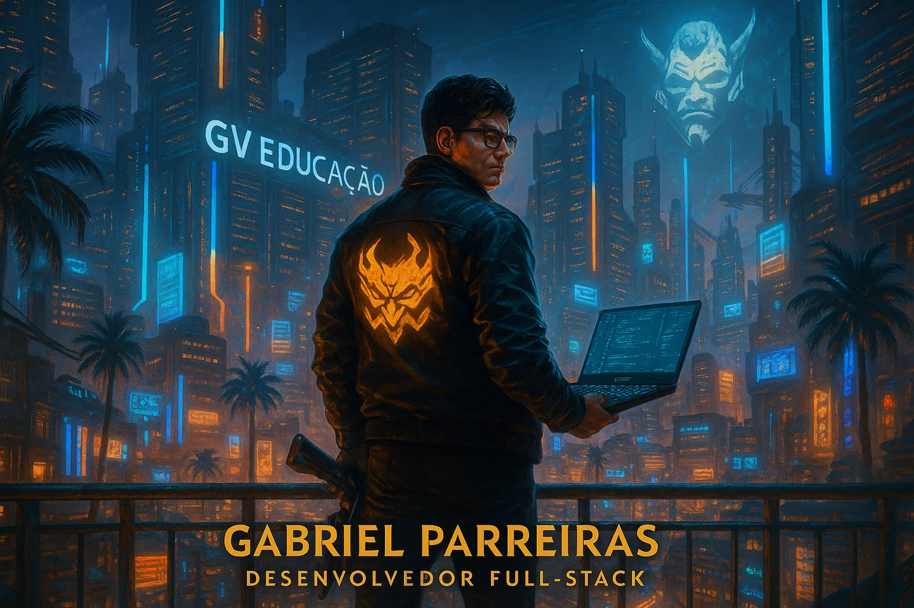

 

 

  <h3>Sobre mim</h3>
      Olá! Sou <strong>Gabriel Parreiras</strong>, um <strong>Desenvolvedor Full-Stack</strong> que vive tecnologia, inovação e o universo Cyberpunk. 
      Meu foco está em transformar desafios complexos em soluções práticas e criativas, sempre unindo performance, boas práticas e uma pitada de estética futurista. 
      Atualmente estudo <strong>Desenvolvimento Fullstack</strong> e <strong>Engenharia de Software</strong>, buscando expandir minhas habilidades e compartilhar conhecimento com a comunidade tech. 
      <strong>Explore meus projetos, conecte-se e sinta-se convidado a colaborar!</strong>
    </td>

<em>Em um mundo onde o código é a moeda, quem domina a tecnologia cria o próprio destino.</em>

## 🚦 O que você vai encontrar aqui

- **Projetos pessoais**: aplicações web com visual e experiência inspirados no universo Cyberpunk, do front ao back-end.
- **Projetos de monitoria & mentorias**: soluções que ajudo a desenvolver com alunos e comunidade.
- **Portfólio de impacto**: destaque para soluções que unem tecnologia, usabilidade e visão de negócios, sempre com toque visual Cyberpunk.

---

## 💼 Estratégia e Posicionamento

- <strong>Branding Visual Futurista:</strong> Elementos Cyberpunk transmitem criatividade, ousadia e visão de futuro.
- <strong>Autoridade Técnica:</strong> Compartilho projetos, soluções full-stack e aprendizados no GitHub, LinkedIn e eventos.
- <strong>Conteúdo de Valor:</strong> Escrevo artigos, tutorias e documentações para desenvolver a comunidade dev.
- <strong>Networking Inteligente:</strong> Participação ativa em comunidades, hackathons e eventos para criar conexões relevantes.
- <strong>Aprendizagem Contínua:</strong> O universo tech não para — e eu também não.

---

## 🚧 Tecnologias e o que estou construindo

- Evoluindo em **JavaScript**, **Node.js**, **React**, **Banco de Dados** e arquitetura full-stack
- Explorando tendências em **Inteligência Artificial** e **Automação**
- Criando aplicações web inspiradas no universo Cyberpunk

---

## 🚀 Minha Stack

  
  
  
  
  
  
  
  
  
  

---

## 🌐 Conecte-se comigo

  
  
  
  

---

> _"O futuro pertence aos programadores que criam e inovam hoje."_

---

